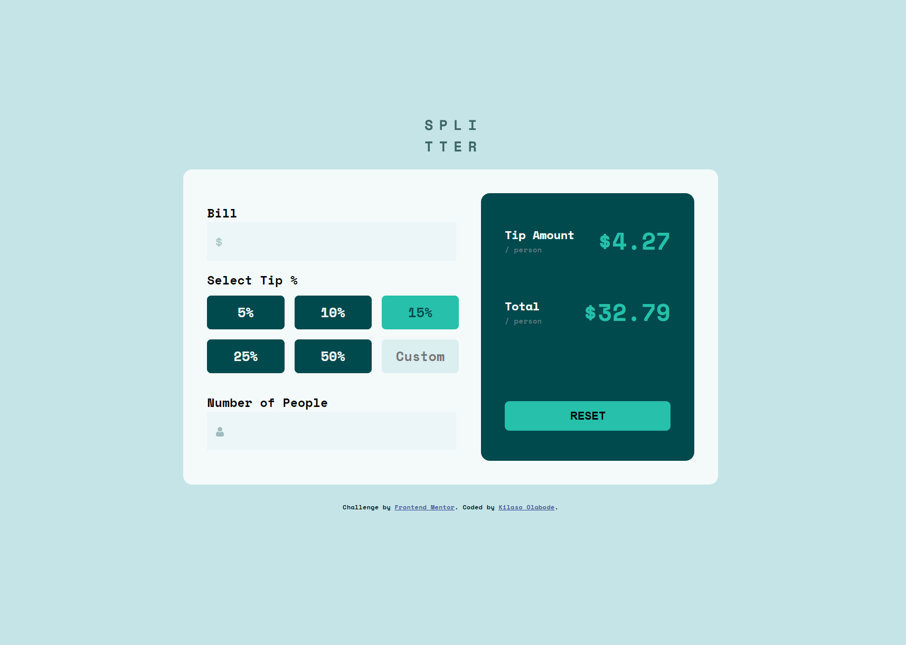

# tip-calculator-fem
# Frontend Mentor - Tip calculator app solution

This is a solution to the [Tip calculator app challenge on Frontend Mentor](https://www.frontendmentor.io/challenges/tip-calculator-app-ugJNGbJUX). Frontend Mentor challenges help you improve your coding skills by building realistic projects.

### Screenshot



### The challenge
Users should be able to:

- View the optimal layout for the app depending on their device's screen size
- See hover states for all interactive elements on the page
- Calculate the correct tip and total cost of the bill per person

### Links

- Solution URL: [Github Url](https://github.com/Great-kiola/Product-preview)
- Live Site URL: [Deployed Url](https://tips-calculator-fem.netlify.app/)

## My process

### Built with

- Semantic HTML5 markup
- CSS custom properties
- Flexbox
- CSS Grid

### What I learned
This is one of the most challenging projects i have encountered in the frontend mentor catalog, As it help me tackle my weak javascript points
I challenged myself to do the javascript aspect of the project

some New things i learnt
- 
```javascript
billInput.addEventListener("input", billInputFun);

function billInputFun() {
  billValue = parseFloat(billInput.value);
  calculateTip();

}
```
You can creat a function and go to another line to declare it

- I also tried not to use jquery in this project and tried to focus on the part i dont really understand
which is the event listeners.


### Continued development
- Add dark mode.


### Useful resources
Css Tricks, Mdn Docs

- youTube: [codeAgam](https://www.youtube.com/watch?v=etYv-pPfol4) : This youtube channel is the one that i found that provided the readable and straightforward solutioon to the javascript aspect of my project,
i had few problem following what he was doing as we didnt use the same naming convention in the project but i was able to follow along carefully.

## Author
- Frontend Mentor - [@great-kiola](https://www.frontendmentor.io/profile/Great-kiola)

## Acknowledgments
Css Tricks, Mdn Docs , codeAgam(YouTube).
